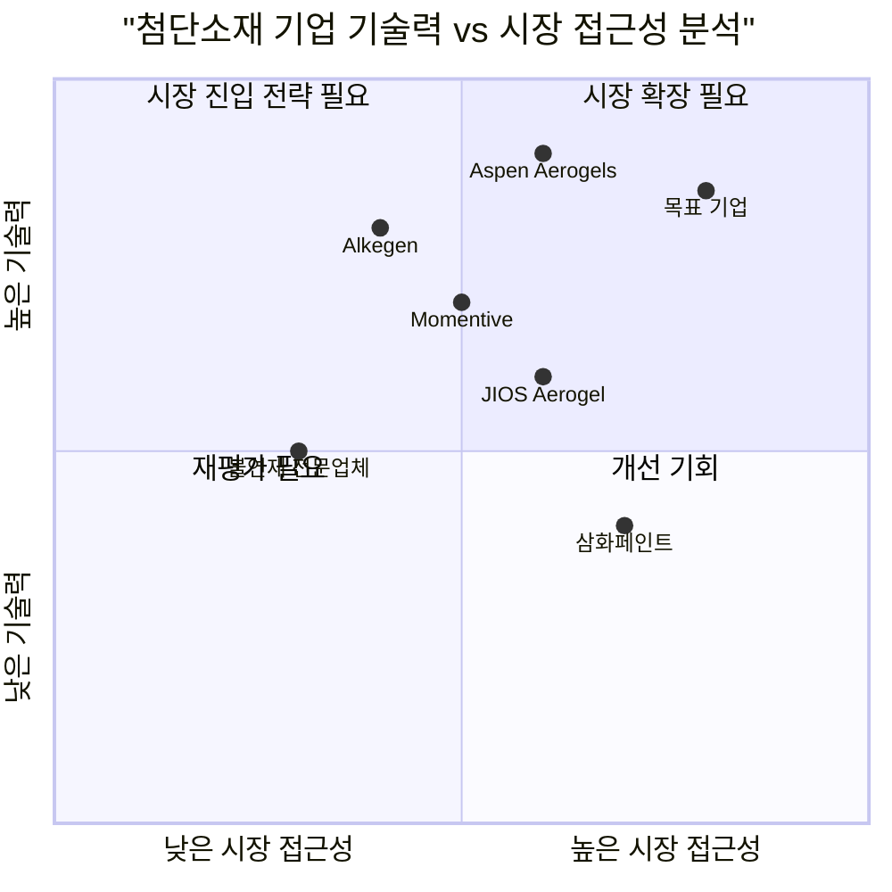

# B2B 첨단소재 기업 홈페이지 PRD (Product Requirements Document)

## 1. 언어 및 프로젝트 정보

- **언어**: 한국어
- **프로그래밍 언어**: React, JavaScript, Tailwind CSS
- **프로젝트명**: advanced_materials_website
- **원본 요구사항**: B2B 첨단소재 기업 홈페이지 기획안 - 무기질 기반 불연 코팅제, 방염 도료, 에어로겔 기술 등을 보유한 기업의 미래지향적이고 전문적인 웹사이트 구축

## 2. 제품 정의

### 2.1 제품 목표

1. **기술 신뢰성 극대화**: 20년간 축적된 불연 코팅 기술력과 에어로겔 혁신 기술을 시각적으로 입증하여 B2B 고객의 신뢰 확보
2. **리드 생성 최적화**: 국방, 항공우주, 조선, 2차 전지 산업 등 타겟 고객군의 구매 여정을 고려한 전환율 중심 웹사이트 구축
3. **브랜드 차별화 강화**: '보이지 않는 기술이 세상을 더 안전하고 지속가능하게 만든다'는 핵심 가치를 통한 시장 내 독보적 포지셔닝 확립

### 2.2 사용자 스토리

1. **As a** 국방/항공우주 조달 담당자, **I want** 극한 환경에서의 코팅제 성능을 시각적으로 확인할 수 있는 시뮬레이터를 **so that** 제품 도입 전 성능을 사전 검증할 수 있다
2. **As a** 전기차 배터리 제조업체 엔지니어, **I want** 에어로겔 기반 열폭주 방지 기술의 구체적인 성능 데이터와 적용 사례를 **so that** 안전성 규제 요구사항을 충족하는 솔루션을 선택할 수 있다
3. **As a** 조선업체 구매 담당자, **I want** 해양 환경에서의 내구성과 방염 성능 정보를 쉽게 찾을 수 있도록 **so that** 신속한 의사결정을 내릴 수 있다
4. **As a** 건축 자재 유통업체 대표, **I want** 불연/준불연 내외장재 패널의 인증 정보와 시공 사례를 **so that** 고객에게 확실한 제품을 추천할 수 있다
5. **As a** 모바일 사용자, **I want** 언제 어디서나 제품 정보에 쉽게 접근하고 문의할 수 있도록 **so that** 업무 효율성을 높일 수 있다

### 2.3 경쟁사 분석

1. **삼화페인트** 
   - 장점: 국내 방염 도료 시장 선도, 풍부한 시공 실적
   - 단점: 전통적 웹사이트 구조, 혁신 기술 부각 부족

2. **불연재 전문업체**
   - 장점: 세라믹 코팅제 특화 기술, 다양한 적용 분야
   - 단점: 브랜드 인지도 한계, 디지털 마케팅 미흡

3. **Aspen Aerogels (미국)**
   - 장점: 글로벌 에어로겔 시장 선도, 대형 OEM 고객 확보
   - 단점: 고가 정책, 아시아 시장 접근성 제한

4. **Momentive (항공우주 소재)**
   - 장점: 체계적인 제품 분류, 기술 문서 제공
   - 단점: 복잡한 네비게이션, 사용자 경험 최적화 부족

5. **Alkegen**
   - 장점: 혁신적 에어로겔 기술, 친환경 포지셔닝
   - 단점: 신규 기업으로 시장 신뢰도 구축 필요

6. **JIOS Aerogel**
   - 장점: 아시아 시장 기반, 대량 생산 능력
   - 단점: 브랜드 스토리텔링 약함

7. **국내 화학소재 기업들**
   - 장점: 로컬 시장 이해도 높음
   - 단점: 글로벌 기술 경쟁력 부족, 디지털 전환 지연

### 2.4 경쟁 사분면 차트



## 3. 기술 사양

### 3.1 요구사항 분석

본 프로젝트는 B2B 첨단소재 기업의 기술력과 신뢰성을 극대화하는 웹사이트 구축을 목표로 합니다. 주요 기술적 요구사항은 다음과 같습니다:

- **반응형 웹 디자인**: 모바일, 태블릿, 데스크톱 환경 최적화
- **고성능 미디어 처리**: 4K 동영상 배경, 3D 렌더링 시뮬레이터
- **인터랙티브 요소**: 파티클 효과, 패럴랙스 스크롤링, 키네틱 타이포그래피
- **SEO 최적화**: B2B 타겟 키워드 최적화 및 구조화된 데이터
- **다국어 지원**: 한국어, 영어 기본 제공
- **CMS 연동**: 제품 정보 및 기술 문서 관리 시스템

### 3.2 요구사항 풀

#### P0 (Must-have) 요구사항

1. **Hero Section 구현**
   - 4K 고화질 동영상 배경 (극한 환경 테스트 영상)
   - 강력한 헤드라인 "보이지 않는 기술이 세상을 더 안전하고 지속가능하게 만듭니다"
   - 마우스 인터랙션 파티클 효과
   - 모바일 환경 동영상 대체 이미지 제공

2. **핵심 섹션 구성**
   - Our Technology: 열 제어, 화재 안전, 에너지 효율 기술 플랫폼
   - Applications: 국방/항공우주, 조선/해양, 2차 전지, 건축 분야별 적용 사례
   - Sustainability: ESG 가치 및 환경 기여도

3. **가상 극한 환경 시뮬레이터**
   - 제품 선택 (항공기 부품, 배터리팩, 건축 외장재)
   - 환경 조건 설정 (1500°C 화염, -200°C 극저온, 외부 충격)
   - 3D 렌더링 비교 시연
   - 모바일 간소화 버전 제공

4. **반응형 디자인**
   - 모바일 터치 최적화
   - 햄버거 메뉴 구현
   - 로딩 속도 최적화

#### P1 (Should-have) 요구사항

1. **고급 인터랙티브 요소**
   - 패럴랙스 스크롤링 효과
   - 키네틱 타이포그래피
   - 마이크로 애니메이션

2. **콘텐츠 관리 시스템**
   - 제품/기술 문서 업로드 기능
   - 사례 연구 관리
   - 뉴스/공지사항 관리

3. **리드 생성 최적화**
   - 동적 문의 폼
   - 샘플 요청 시스템
   - 견적 요청 기능

4. **SEO 및 분석**
   - 구조화된 데이터 마크업
   - Google Analytics 4 연동
   - 히트맵 분석 도구

#### P2 (Nice-to-have) 요구사항

1. **AI 기반 기능**
   - 챗봇 고객 상담
   - 개인화된 제품 추천
   - 자동 번역 기능

2. **소셜 미디어 연동**
   - LinkedIn, YouTube 콘텐츠 임베드
   - 소셜 공유 기능
   - 실시간 소셜 피드

3. **고급 시각화**
   - AR/VR 제품 체험
   - 360도 제품 뷰어
   - 실시간 데이터 대시보드

### 3.3 UI 디자인 초안

#### 메인 페이지 구조

```
┌─────────────────────────────────────────┐
│ HEADER (고정 네비게이션)                    │
├─────────────────────────────────────────┤
│ HERO SECTION                            │
│ - 4K 동영상 배경 (극한환경 테스트)          │
│ - 헤드라인: "보이지 않는 기술이..."         │
│ - 파티클 인터랙션 효과                     │
│ - CTA: "기술 체험하기"                    │
├─────────────────────────────────────────┤
│ OUR TECHNOLOGY                          │
│ ┌─────────┬─────────┬─────────┐          │
│ │열 제어   │화재 안전 │에너지    │          │
│ │기술     │기술     │효율 기술  │          │
│ └─────────┴─────────┴─────────┘          │
├─────────────────────────────────────────┤
│ VIRTUAL SIMULATOR                       │
│ - 제품 선택 드롭다운                       │
│ - 환경 조건 슬라이더                       │
│ - 3D 비교 렌더링 영역                      │
├─────────────────────────────────────────┤
│ APPLICATIONS                            │
│ [국방/항공] [조선/해양] [2차전지] [건축]     │
├─────────────────────────────────────────┤
│ SUSTAINABILITY                          │
│ - ESG 가치 제안                          │
│ - 환경 기여도 인포그래픽                   │
├─────────────────────────────────────────┤
│ CONTACT & FOOTER                        │
└─────────────────────────────────────────┘
```

#### 모바일 디자인 고려사항

- **터치 최적화**: 최소 44px 터치 타겟 크기
- **로딩 최적화**: 동영상 대신 고해상도 이미지 사용
- **내비게이션**: 햄버거 메뉴로 공간 효율화
- **시뮬레이터**: 간소화된 결과 표시 방식
- **폰트 크기**: 16px 이상 가독성 확보

### 3.4 미해결 질문

1. **회사명 및 로고**: 구체적인 회사명과 브랜드 아이덴티티 가이드라인 필요
2. **기존 웹사이트**: 현재 웹사이트 유무 및 리뉴얼/신규 구축 여부 확인
3. **콘텐츠 소스**: 제품 이미지, 기술 영상, 인증서 등 실제 콘텐츠 자료 확보 방안
4. **예산 및 일정**: 개발 예산 범위 및 론칭 목표 일정
5. **운영 담당자**: 웹사이트 콘텐츠 관리 및 업데이트 담당 인력
6. **호스팅 환경**: 서버 인프라 및 CDN 구성 요구사항
7. **보안 요구사항**: B2B 고객 정보 보호를 위한 보안 정책
8. **다국어 범위**: 한국어, 영어 외 추가 언어 지원 필요성
9. **제3자 연동**: ERP, CRM 시스템과의 연동 필요성
10. **법적 요구사항**: 개인정보처리방침, 이용약관 등 법적 컴플라이언스

---

**문서 생성일**: 2025-06-12  
**작성자**: Emma (Product Manager)  
**버전**: 1.0  
**승인 상태**: 검토 대기